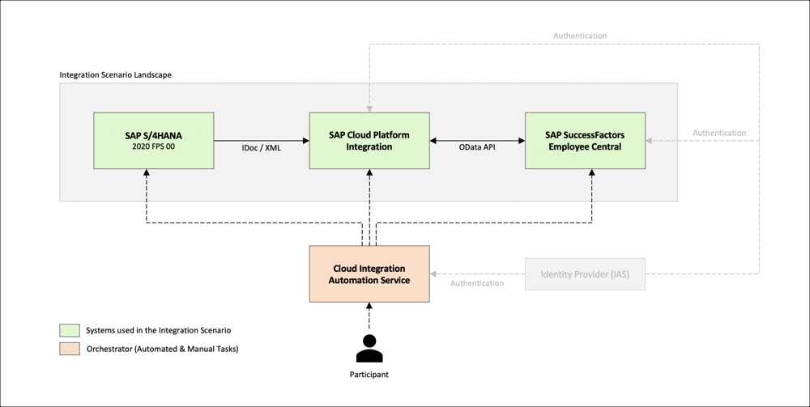

# IIS160 - Integrate SAP S/4HANA with SAP SuccessFactors Solutions

## Description

This repository contains the material for the SAP TechEd 2020 session called IIS160 - Integrate SAP S/4HANA with SAP SuccessFactors Solutions.

## Overview

In this session, you will get hands-on with the Cloud Integration Automation Service (CIAS) to configure the integration scenario Replicating Cost Centers from SAP S/4HANA On Premise to SAP SuccessFactors Employee Central in an automated way. The scenario is part of the so called Core Hybrid HCM deployment option, which you can use to transfer your HR solutions to SAP SuccessFactors, yet keeping the cloud system integrated with your existing SAP S/4HANA system landscape.  
  

## Requirements

The requirements to follow the exercises in this repository are:

- Web browser (preferably Google Chrome)
- SAP GUI

## Exercises

Start the exercises [here](exercises/README.md).

## How to obtain support

Support for the content in this repository is available during the actual time of the online session for which this content has been designed. Otherwise, you may request support via the [Issues](../../issues) tab.

## License
Copyright (c) 2020 SAP SE or an SAP affiliate company. All rights reserved. This file is licensed under the Apache Software License, version 2.0 except as noted otherwise in the [LICENSE](LICENSE) file.
