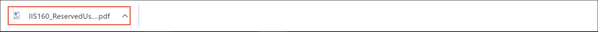
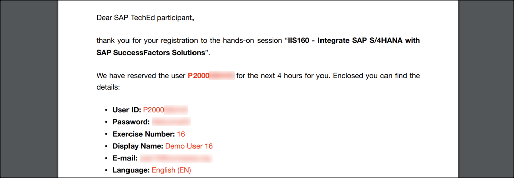
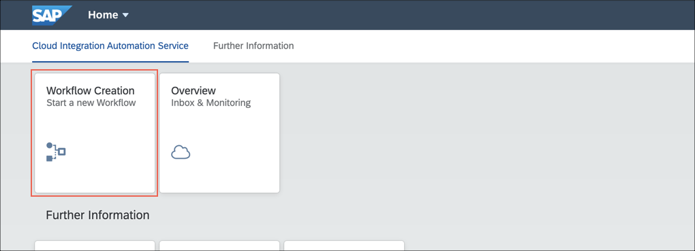
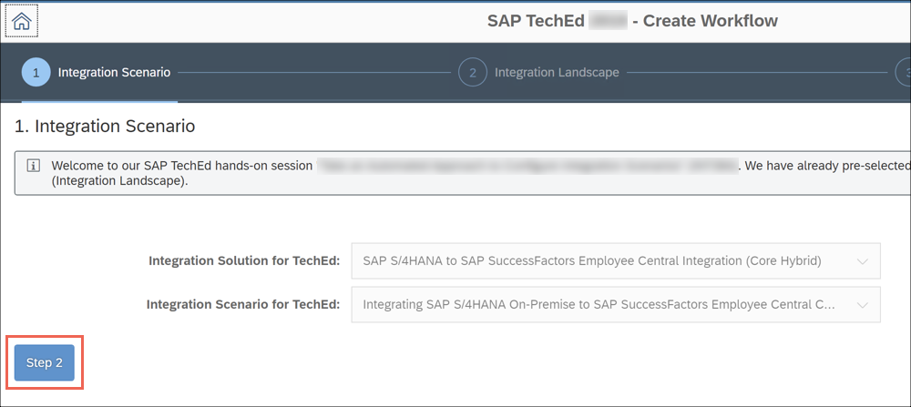
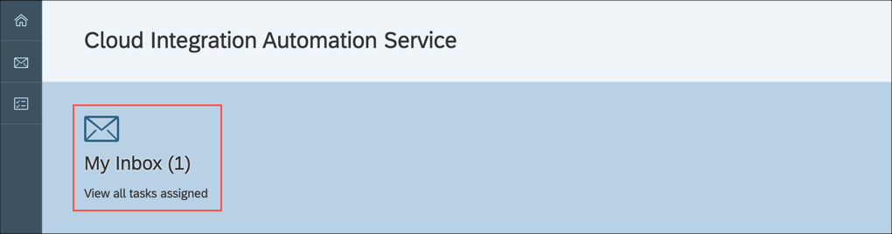
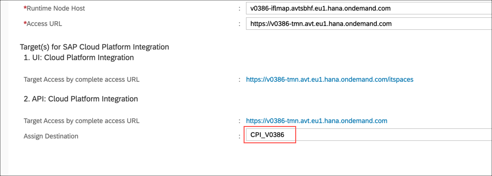
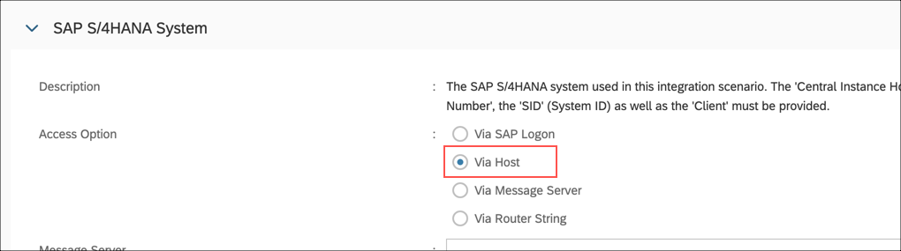
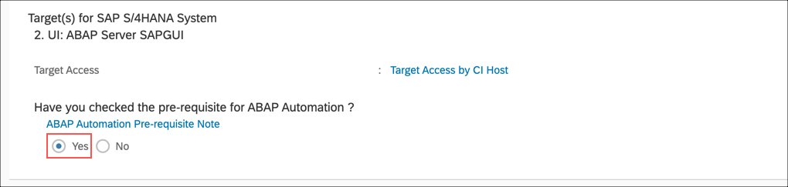
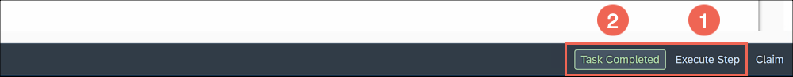

# Exercises - IIS160

Run the following exercises to complete the hands-on:  

## Reserving an Exercise User

- Open the [**User Registration Self-Service**](https://iis160-dispatcher.cfapps.eu10.hana.ondemand.com/users/iis160/reserve) for the hands-on session. A PDF document with the session details is automatically downloaded.  
  
- With the user details provided you can log on to all systems required in this hands-on session.  
    

## Creating the Workflow Instance

- Open the [**IIS160 Launchpad**](https://flpnwc-adc04c831.dispatcher.hana.ondemand.com/sites/teched-launchpad) in Google Chrome and logon with the reserved user from the previous exercise [Reserving an Exercise User](#reserving-an-exercise-user).  
- Choose the **Workflow Creation** tile.  
  
- The **Create Workflow** application opens in a new browser tab.  
- The **Integration Scenario** parameters are already pre-selected for this hands-on. Therefore, simply choose **Step 2** to continue.  
  
- On the **Integration Landscape** step, select **SFPART056049** as **SAP SuccessFactors Employee Central instance** [1], **V0386** as **SAP Cloud Platform Integration tenant** [2] and **S4H** as **SAP S/4HANA On-Premise system** [3].  
- Choose **Review** [4] to continue.  
  
- **Review** your selections on the **Summary** screen and choose **Generate Workflow**. The workflow will be generated and activated for the user reserved in the step [Reserving an Exercise User](#reserving-an-exercise-user).  
  
- Once the **Workflow** is ready you will see a success message on the screen.  
- Choose **Cloud Integration Automation Service Inbox** link to start.  
    

## Running the Workflow in the Cloud Integration Automation Service

- Open the [**Cloud Integration Automation Service**](https://cias-buoxpnldir.dispatcher.hana.ondemand.com/index.html) in Google Chrome and logon with the reserved user from the previous exercise [Reserving an Exercise User](#reserving-an-exercise-user).  
- Choose **My Inbox**.  
  
- The first workflow task is loaded. Read the **Disclaimer** carefully and choose **I Agree** to continue.  
- In the **Confirm System Components** task, identify the **SAP Cloud Platform Integration** system and assign the destination **CPI_V0386** to the field **Assign Destination**.  
  
- Scroll down to the **SAP S/4HANA System** and switch the **Access Option** from **Via SAP Logon** to **Via Host**.  
  
- Finally, set the **Have you checked the pre-requisite for ABAP Automation?** option to **Yes**.  
  
- Choose **Confirm Systems** and continue with the instructions given in the workflow.      

## Important
Please observe the following notes when executing the workflow: 

#### Automated Task Execution
- Please ensure that you always execute the automation using **Execute Step** [1] before you complete a task using **Task Completed** [2].  
  
